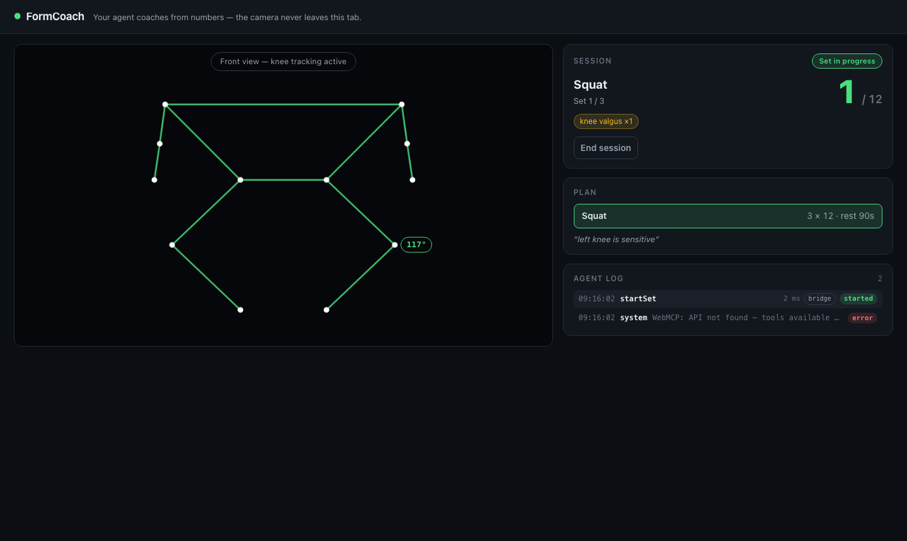

# FormCoach

**Work out in front of your webcam. The page measures your reps and form — entirely inside the browser tab — and hands the numbers to any browser agent as WebMCP tools. The agent becomes your coach without ever seeing a frame of video.**

- **Live app:** _added on deploy_ (Vercel)
- **Demo video:** _added on submission_
- Built for the [WebMCP Challenge](https://webmcp.devpost.com/)



## Why WebMCP

The camera stream exists only in this tab. A server-side MCP tool with the same job would need the video uploaded somewhere. With WebMCP, MediaPipe Pose runs on-device, and the agent gets a live numeric contract instead: joint angles, rep counts, tempo, and form flags. The agent knows *how you're moving* — it never sees *you*.

The interaction design follows from the same constraint: mid-set your hands are busy and sweaty, so the agent's write actions are confirmed with **body gestures** (raise both hands to accept, cross your arms to decline) detected by the same pose model.

## What the agent can do

Seven imperative tools plus one declarative form. Read tools are annotated `readOnlyHint` so agents can poll freely; write tools gate on the human.

| Tool | What it does | Read-only |
|---|---|---|
| `getWorkoutPlan` | Today's plan: blocks, creator (user/agent), injury note | ✓ |
| `getLiveMetrics` | Live phase, reps, joint angle, view, form flags, rest timer | ✓ |
| `getSetHistory` | Completed sets: reps vs target, flag counts, avg tempo | ✓ |
| `startSet` | Starts the next set after a 3s countdown | |
| `setRest` | Sets rest duration (10–600s), live timer included | |
| `adjustProgram` | Proposes swap_exercise / reduce_reps / add_set / extend_rest — resolves only after the user's gesture (or 20s timeout) | |
| `endSession` | Ends the session, returns summary + recommendations | |
| `createPlan` (declarative `<form toolname>`) | Creates the plan; the handler reads `SubmitEvent.agentInvoked` to credit the agent | |

**The tool set follows the workout phase** — registrations are scoped to `AbortController`s and swapped on every transition:

| Phase | Active tools (besides the three read tools) |
|---|---|
| idle | startSet, createPlan form |
| countdown | endSession |
| set | adjustProgram, setRest, endSession |
| rest | startSet, setRest, adjustProgram, endSession |
| awaiting confirmation | endSession |
| done | createPlan form |

## Try it

**Path A — ChatGPT in-app browser (site tools):** open the live URL, allow the camera, and talk to the agent.

**Path B — Chrome:** enable `chrome://flags/#enable-webmcp-testing` (or `#enable-experimental-web-platform-features`), install a Model Context Tool Inspector extension, and open the live URL.

Prompt script (the demo video follows the same order):

1. "Create a 3x12 squat plan with 90 seconds rest. Note that my left knee is sensitive."
2. "Start the first set."
3. *(do a few squats, let some knees cave in)* "How's my form so far?"
4. "If my knees keep caving in, switch me to something safer."
5. *(raise both hands to accept)* "What changed?"
6. "Cut the rest to 45 seconds."
7. "End the session and give me a summary."

No camera? Append `?debug=1` to the URL for the debug panel and replay recorded pose fixtures instead.

## The human–agent experience

- **Gesture confirmation:** `adjustProgram` returns a pending promise until you raise both hands (accept), cross your arms (decline), or 20s pass. On-screen buttons exist as a fallback.
- **Agent log:** every tool call is rendered in the UI with source (browser agent vs debug bridge), status, and latency — you always see what the agent did.
- **`agentInvoked` attribution:** a plan submitted by the agent through the declarative form gets a "Created by agent" badge.
- **Voice:** the page speaks proposals and set completions via `speechSynthesis`.

## How it works

```
webcam ──▶ MediaPipe Pose (in-tab, on-device)
              │  33 landmarks / frame
              ▼
        pose engine ─ rep FSM · form rules · gesture dwell
              │  numbers only
              ▼
       session machine (idle→countdown→set→rest→done)
              │
              ▼
   WebMCP tools (document.modelContext) ◀──▶ browser agent
```

Privacy: no backend, no accounts, no uploads. Video frames never leave the `<video>` element; tools return JSON numbers and strings. The plan is kept in `localStorage`, set history in memory.

## Run locally

```bash
npm install
npm run dev        # http://localhost:5173
```

- `npm run test` — Vitest unit tests (rep counter, rules, gestures, state machine, tool registration)
- `npm run e2e` — Playwright end-to-end session (`npx playwright install chromium` first)
- `npm run gen:fixtures` — regenerate the synthetic landmark fixtures in `fixtures/`

### Debug bridge

Everything is testable without a camera. `window.__formcoach` exposes:

```js
__formcoach.listTools()                  // internal registry (mirrors the browser API)
__formcoach.callTool(name, input)        // same execute path a real agent hits
__formcoach.phase()                      // current session phase
__formcoach.replay("squat_10reps_side", 4) // feed a fixture through the engine
__formcoach.setConfirmTimeoutMs(3000)    // shrink the gesture timeout for tests
```

URL params: `?debug=1` (debug panel) · `?replay=<fixture|none>` (skip camera) · `&speed=4`.

## Roadmap

- Move the "eyes" into a browser extension so any workout or rehab site can publish its own exercise spec and be coached by the same agent.
- Cross-site sessions: a tracker site and a coach agent sharing one WebMCP contract.
- Rehab verticals: physiotherapy ranges-of-motion as first-class tool schemas.

## License & credits

MIT. Built with [MediaPipe Tasks Vision](https://ai.google.dev/edge/mediapipe/solutions/vision/pose_landmarker/web_js), React, TypeScript, Vite, Vitest, Playwright.
